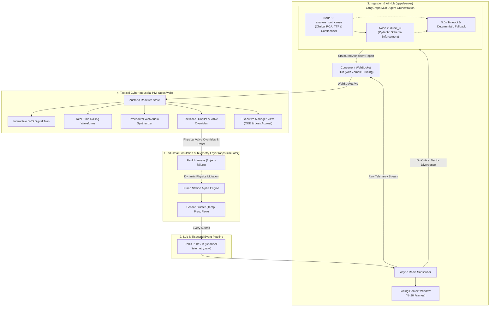

<div align="center">

# 🛡️ AEGIS OS 2.0
### Tactical Cyber-Industrial Mission Control & Alarm-Fatigue Eradication Engine

*Autonomous AI-Assisted Operational Intelligence for Mission-Critical Infrastructure*

---

[-000000?style=for-the-badge&logo=nextdotjs&logoColor=white)](#)
[](#)
[](#)
[](#)
[](#)
[](#)

</div>

---

## 📑 Table of Contents
- [Executive Overview](#-executive-overview)
- [The Cognitive Crisis: Eradicating Alarm Fatigue](#-the-cognitive-crisis-eradicating-alarm-fatigue)
- [System Architecture Blueprint](#-system-architecture-blueprint)
- [Core Feature Matrix](#-core-feature-matrix)
- [Deep Dive: Subsystem Architecture](#-deep-dive-subsystem-architecture)
  - [1. Interactive Digital Twin & Hydraulic Schematic](#1-interactive-digital-twin--hydraulic-schematic)
  - [2. High-Density Telemetry Waveforms & Sparklines](#2-high-density-telemetry-waveforms--sparklines)
  - [3. LangGraph Autonomous AI Incident Director](#3-langgraph-autonomous-ai-incident-director)
  - [4. Procedural Web Audio Synthesis Engine](#4-procedural-web-audio-synthesis-engine)
  - [5. Executive Manager KPI Dashboard](#5-executive-manager-kpi-dashboard)
- [Resilience & SRE Design Patterns](#-resilience--sre-design-patterns)
- [Tech Stack Decomposition](#-tech-stack-decomposition)
- [Getting Started & Local Development](#-getting-started--local-development)
- [1-Click Cloud Deployment (Vercel)](#-1-click-cloud-deployment-vercel)
- [API Contracts & Pydantic Schemas](#-api-contracts--pydantic-schemas)
- [Project Directory Structure](#-project-directory-structure)
- [License](#-license)

---

## 🌐 Executive Overview

Modern industrial environments (e.g., nuclear power generation, chemical processing facilities, water distribution networks, and turbine stations) generate tens of thousands of telemetry datapoints per second. In crisis scenarios, a single physical component failure triggers an avalanche of secondary sensor alarms across the entire plant floor.

**Aegis OS** is an adaptive, next-generation **Human-Machine Interface (HMI)** and supervisory mission control platform. Instead of bombarding human operators with hundreds of screaming, disconnected sensor alerts, Aegis OS continuously captures high-frequency telemetry, correlates multi-sensor divergence vectors across temporal sliding windows, orchestrates autonomous multi-agent reasoning with **LangGraph**, and serves **prioritized root-cause intelligence, time-to-failure (TTF) predictions, and actionable mitigation protocols** through an interactive, cyber-industrial command center.

---

## ⚡ The Cognitive Crisis: Eradicating Alarm Fatigue

```
TRADITIONAL HMI (Alarm Fatigue)             AEGIS OS 2.0 (Cognitive Synthesis)
┌──────────────────────────────────────┐     ┌──────────────────────────────────────┐
│ [!] Sensor 104 Pressure High        │     │  AI INCIDENT DIRECTOR (LANGGRAPH)    │
│ [!] Sensor 105 Pressure High        │     │  ──────────────────────────────────  │
│ [!] Sensor 106 Temp Warning         │ ──> │  🚨 THERMAL RUNAWAY & CAVITATION     │
│ [!] Sensor 107 Flow Rate Low        │     │  Confidence: 98.4% | TTF: 35 Seconds │
│ [!] Sensor 108 Valve Backpressure    │     │  Root Cause: Upstream intake drop    │
│ [!] Sensor 109 Vibration Spike       │     │  Action: Engage Bypass Valve V-102   │
│ ... 240+ raw alerts/minute           │     │  Status: 98.8% Alarm Fatigue Filtered│
└──────────────────────────────────────┘     └──────────────────────────────────────┘
```

---

## 🏛️ System Architecture Blueprint



---

## 🏆 Core Feature Matrix

| Capability | Technical Implementation | Operational Value |
| :--- | :--- | :--- |
| **Interactive Digital Twin** | Vector SVG with synchronized fluid flow velocity, spinning rotor, thermal heatmap aura, and clickable valves | Full physical situational awareness; visualize exact physical fluid bottlenecks instantly. |
| **High-Density Telemetry** | Rolling SVG sparklines (40-frame sliding window), rate-of-change ($\Delta/s$) indicators, load arcs, and statistical min/avg/max ribbons | Preemptive anomaly detection; detect pressure surges before physical boundaries rupture. |
| **Multi-Agent RCA** | LangGraph state graph powered by Llama-3-8B / Groq with clinical operational reasoning | Converts hundreds of raw alerts into 1 high-signal, actionable diagnosis with Time-to-Failure (TTF). |
| **Tactile Audio Engine** | Procedural zero-dependency Web Audio API oscillator synthesis (clicks, switches, chimes, klaxon alarm loops) | Multi-sensory operator feedback; acoustic awareness without eye contact. |
| **Interactive Mitigation** | Checkable step-by-step mitigation checklist with direct physical valve bypass switches | Reduces Mean Time to Recovery (MTTR) by enabling instant physical action from the AI recommendation. |
| **Executive Manager Mode** | Live OEE decomposition (Availability, Performance, Quality), financial downtime loss accumulator, and alarm suppression ratio | Strategic visibility for plant managers with compliance-grade audit exporting. |
| **Simulation Toolbelt** | Instant scenario injection (**Cavitation**, **Thermal Surge**, **Water Hammer**, **Normal**) + parameter sliders | Turnkey demonstration platform; test failure modes on demand without physical equipment risk. |

---

## 🔬 Deep Dive: Subsystem Architecture

### 1. Interactive Digital Twin & Hydraulic Schematic
Located in [`apps/web/components/DigitalTwinSchematic.tsx`](file:///d:/project%20new/apps/web/components/DigitalTwinSchematic.tsx), the schematic models **Pump Station Alpha**:
- **Dynamic Fluid Velocity**: Animated SVG pipe particles calculate velocity on the fly. During severe cavitation, fluid velocity drops from nominal speed to a near-stall, alerting operators visually.
- **Rotor Dynamics**: Rotating impeller turbine blades whose angular velocity and vibration frequency reflect physical load and RPM.
- **Thermal Heat Aura**: Dynamic radial gradient radiating outward from the central pump volute shell that blooms from cool blue to glowing crimson (`#FF0055`) during thermal runaway.
- **Clickable Physical Valves**:
  - `V-101 INLET`: Primary gate valve.
  - `V-102 BYPASS`: Auxiliary bypass manifold.
  - `PRV-201`: Emergency hydraulic pressure relief valve.

---

### 2. High-Density Telemetry Waveforms & Sparklines
Located in [`apps/web/components/SensorWidget.tsx`](file:///d:/project%20new/apps/web/components/SensorWidget.tsx):
- **Continuous Historical Waveform**: Real-time SVG sparkline tracking the sliding 40-frame telemetry window with safety threshold limit lines and dynamic area fill gradients.
- **Rate-of-Change ($\Delta/s$)**: Calculates instantaneous mathematical derivatives ($dy/dt$) between successive frames, alerting operators to rapid pressure surges before threshold limits are breached.
- **Statistical Ribbon**: Micro-badges tracking real-time Minimum, Rolling Average, and Maximum values.
- **Critical Mutation**: Screen-tearing glitch vibration and pulsing emergency borders during critical anomalies.

---

### 3. LangGraph Autonomous AI Incident Director
Located in [`apps/server/ai_agent.py`](file:///d:/project%20new/apps/server/ai_agent.py):
- **Node 1 (`node_analyze_root_cause`)**: Consumes the sliding 20-frame context window and evaluates multi-sensor coupling. Enforces clinical terminology (*Supercritical Cavitation*, *Thermal Runaway*, *Transient Shockwaves*, *Upstream Constriction*) and outputs Confidence Scores and Time-to-Failure (TTF) estimates.
- **Node 2 (`node_direct_ui`)**: Structures the unstructured reasoning output into strict JSON adhering to the [`AIIncidentReport`](file:///d:/project%20new/packages/shared/schemas.py) Pydantic contract.
- **Tactical Copilot Interface ([`AICopilot.tsx`](file:///d:/project%20new/apps/web/components/AICopilot.tsx))**: Slide-out tactical drawer featuring typewriter situation summaries, root-cause breakdowns, checkable mitigation checklists, and an emergency **"RESOLVE & RESTORE NOMINAL STATE"** trigger.

---

### 4. Procedural Web Audio Synthesis Engine
Located in [`apps/web/lib/audioEngine.ts`](file:///d:/project%20new/apps/web/lib/audioEngine.ts):
- Zero external audio files or dependencies. Generates procedural waveforms in real time via the browser's native `AudioContext`:
  - **Tactile Click**: High-frequency sine burst for crisp button feedback.
  - **Switch Tone**: Dual-frequency triangle sweep for valve toggles and station switching.
  - **Harmonic AI Chime**: Multi-frequency chord synthesis (C5, E5, G5, C6) when LangGraph delivers an incident report.
  - **Emergency Klaxon Siren**: Repeating sawtooth sweep (880Hz $\to$ 440Hz) with volume slider and one-click global mute.

---

### 5. Executive Manager KPI Dashboard
Located in [`apps/web/components/ManagerView.tsx`](file:///d:/project%20new/apps/web/components/ManagerView.tsx):
- **OEE Composite Metric**: Real-time breakdown of Availability Factor, Performance Efficiency, and Quality Tolerance.
- **Financial Downtime Loss Accumulator**: Live dollar counter ($/sec) calculating financial loss accumulation during unplanned equipment downtime.
- **Alarm Suppression Ratio**: Visual proof of alarm fatigue elimination ($>98\%$ of raw sensor noise filtered into high-signal incident reports).
- **Audit Log Exporter ([`IncidentHistoryDrawer.tsx`](file:///d:/project%20new/apps/web/components/IncidentHistoryDrawer.tsx))**: Chronological blackbox event timeline with 1-click JSON export.

---

## 🛡️ Resilience & SRE Design Patterns

```
┌───────────────────────────┬────────────────────────────────────────────────────────┐
│ SRE Safeguard             │ Implementation Architecture                            │
├───────────────────────────┼────────────────────────────────────────────────────────┤
│ Strict LLM Timeout        │ 5.0-second async timeout on all LangGraph nodes        │
│ Deterministic Fallback    │ Instant static incident payload generation on timeout  │
│ Zombie Connection Pruning │ 1.5s broadcast timeout with aggressive socket eviction │
│ Redis Reconnection Loop   │ Infinite exponential backoff auto-reconnect            │
│ Telemetry Fallback Engine │ Client-side synthetic tick for zero-downtime previews  │
│ Defensive React Parsing   │ Type-safe string/array coercions preventing UI crashes │
└───────────────────────────┴────────────────────────────────────────────────────────┘
```

---

## 💻 Tech Stack Decomposition

### Frontend (Tactical HMI)
- **Framework**: [Next.js 14](https://nextjs.org/) (App Router, Server Components, TypeScript)
- **Styling**: [TailwindCSS](https://tailwindcss.com/) with custom cyber-industrial design system
- **State Architecture**: [Zustand](https://github.com/pmndrs/zustand) with sliding-window history buffers
- **Animation & Physics**: [Framer Motion](https://www.framer.com/motion/) (glitch variants, layout springs)
- **Iconography**: [Lucide React](https://lucide.dev/)
- **Typography**: Orbitron, JetBrains Mono, Inter (via Google Fonts)

### Backend & Ingestion Hub
- **Core Server**: [FastAPI](https://fastapi.tiangolo.com/) with Uvicorn async ASGI
- **Data Validation**: [Pydantic v2](https://docs.pydantic.dev/) for strict contract enforcement
- **Real-Time Communication**: Native asynchronous WebSockets with broadcast aggregation
- **Message Broker**: [Redis](https://redis.io/) (Pub/Sub on channel `telemetry:raw`)

### AI Orchestration
- **Agent Framework**: [LangGraph](https://python.langchain.com/docs/langgraph) (StateGraph pipeline)
- **Inference Engine**: [Groq API](https://groq.com/) (`llama3-8b-8192`) or Local [Ollama](https://ollama.com/) (`llama3`)

---

## 🚀 Getting Started & Local Development

### Prerequisites
- **Node.js** v18.0+ & `npm`
- **Python** 3.10+
- **Redis Server** (listening on `localhost:6379`)

---

### Step 1: Clone Repository
```bash
git clone https://github.com/Spandan228/Aegis-OS.git
cd Aegis-OS
```

---

### Step 2: Start Redis Server
```bash
# macOS (Homebrew)
brew services start redis

# Linux (systemd)
sudo systemctl start redis

# Docker
docker run -d -p 6379:6379 --name aegis_redis redis:7-alpine
```

---

### Step 3: Start Backend Services & Simulator
```bash
# Create & activate virtual environment
python -m venv venv
source venv/bin/activate  # On Windows: .\venv\Scripts\activate

# Install dependencies
pip install -r apps/server/requirements.txt
pip install -r apps/simulator/requirements.txt

# Launch Telemetry Simulator (Port 8001)
python apps/simulator/simulator.py &

# Launch FastAPI Hub & LangGraph Agent (Port 8080)
python apps/server/main.py &
```

---

### Step 4: Start Frontend HMI
```bash
cd apps/web
npm install
npm run dev
```

Open **[http://localhost:3000](http://localhost:3000)** in your browser.

---

### Step 5: Test Live Incident Injection
Trigger a simulated catastrophic cavitation failure directly into the live pipeline:
```bash
curl -X POST http://localhost:8001/inject-failure
```
*Or simply press **`Ctrl + Shift + K`** inside the dashboard or use the floating **Simulation Toolbelt** in the bottom-left corner.*

---

## ☁️ 1-Click Cloud Deployment (Vercel)

Aegis OS is pre-configured with root [`vercel.json`](file:///d:/project%20new/vercel.json) for instant, zero-configuration deployment to [Vercel](https://vercel.com):

1. Push your repository to GitHub:
   ```bash
   git push origin main
   ```
2. Go to **[vercel.com/new](https://vercel.com/new)** and import `Spandan228/Aegis-OS`.
3. Set **Root Directory** to `apps/web`.
4. Click **Deploy**.

---

## 📜 API Contracts & Pydantic Schemas

### 1. Telemetry Ingestion Contract (`SensorTelemetry`)
```python
class SensorTelemetry(BaseModel):
    sensor_id: str = Field(..., description="Unique identifier (e.g., PUMP-ALPHA-TEMP)")
    timestamp: datetime = Field(default_factory=datetime.utcnow)
    sensor_type: SensorType = Field(..., description="temperature | pressure | vibration | flow_rate")
    value: float = Field(..., description="Current numerical physical reading")
    unit: str = Field(..., description="Engineering measurement unit (°C, PSI, L/min)")
    status: TelemetryStatus = Field(default=TelemetryStatus.NOMINAL)
    metadata: Optional[Dict[str, Any]] = Field(default_factory=dict)
```

### 2. AI Incident Report Contract (`AIIncidentReport`)
```python
class AIIncidentReport(BaseModel):
    incident_id: str = Field(..., description="UUID or incident designation")
    timestamp: datetime = Field(default_factory=datetime.utcnow)
    severity: IncidentSeverity = Field(..., description="low | medium | high | critical")
    title: str = Field(..., description="Human-readable tactical headline")
    summary: str = Field(..., description="1-sentence executive summary with TTF estimate")
    root_cause_analysis: str = Field(..., description="Clinical physical mechanism breakdown")
    correlated_sensors: List[str] = Field(..., description="Divergent sensor IDs")
    recommended_actions: List[str] = Field(..., description="Ordered mitigation checklist")
    confidence_score: float = Field(..., ge=0.0, le=1.0)
```

---

## 📁 Project Directory Structure

```text
aegis-os/
├── apps/
│   ├── server/                   # FastAPI ingestion hub & LangGraph multi-agent pipeline
│   │   ├── ai_agent.py           # LangGraph StateGraph (Node 1: RCA, Node 2: UI Director)
│   │   ├── main.py               # Redis subscriber, sliding window buffer & WebSocket manager
│   │   ├── Dockerfile            # Container definition
│   │   └── requirements.txt      # Python dependencies
│   ├── simulator/                # Physical equipment simulation engine
│   │   ├── simulator.py          # Pump station physics, fault injector & Redis publisher
│   │   ├── Dockerfile            # Container definition
│   │   └── requirements.txt      # Python dependencies
│   └── web/                      # Next.js 14 Cyber-Industrial Command Center
│       ├── app/                  # App Router pages, layout & globals.css
│       ├── components/           # Tactical UI components
│       │   ├── AICopilot.tsx     # Slide-out incident director & mitigation checklist
│       │   ├── AgentGraphVisualizer.tsx # LangGraph DAG pipeline & coupling matrix
│       │   ├── DigitalTwinSchematic.tsx # Interactive SVG hydraulic topology
│       │   ├── IncidentHistoryDrawer.tsx # Blackbox audit timeline & JSON export
│       │   ├── ManagerView.tsx   # Executive OEE & financial downtime KPI dashboard
│       │   ├── MissionControlHeader.tsx # Station switcher, UTC clock & guarded E-STOP
│       │   ├── SensorWidget.tsx  # High-density sensor cards with rolling sparklines
│       │   ├── SimulationToolbelt.tsx # Fault injection presets & sliders
│       │   └── WebSocketBridge.tsx # Auto-reconnecting telemetry socket client
│       ├── lib/
│       │   └── audioEngine.ts    # Procedural Web Audio API sound synthesizer
│       ├── store/
│       │   └── useAegisStore.ts  # Zustand reactive global state
│       └── package.json          # Node dependencies
├── packages/
│   └── shared/                   # Cross-service shared contracts
│       └── schemas.py            # Pydantic schemas (SensorTelemetry, AIIncidentReport)
├── docker-compose.yml            # Multi-service local/production stack
├── docker-compose.gpu.yml        # GPU-accelerated Docker stack (NVIDIA)
├── vercel.json                   # 1-Click Vercel deployment configuration
├── .gitignore                    # Production gitignore
├── LICENSE                       # MIT License
└── README.md                     # Documentation
```

---

## 📄 License

Distributed under the **MIT License**. See [`LICENSE`](file:///d:/project%20new/LICENSE) for full details.

---

<div align="center">
  <sub>Built with mission-critical precision for operations engineers, plant managers, and high-stakes infrastructure control.</sub>
</div>
